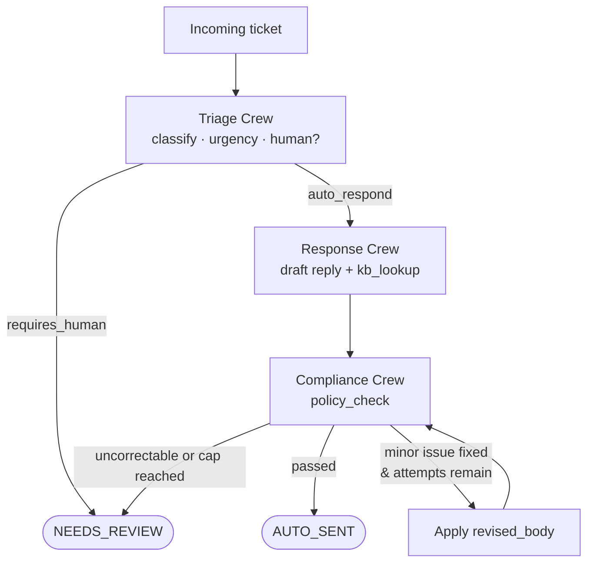
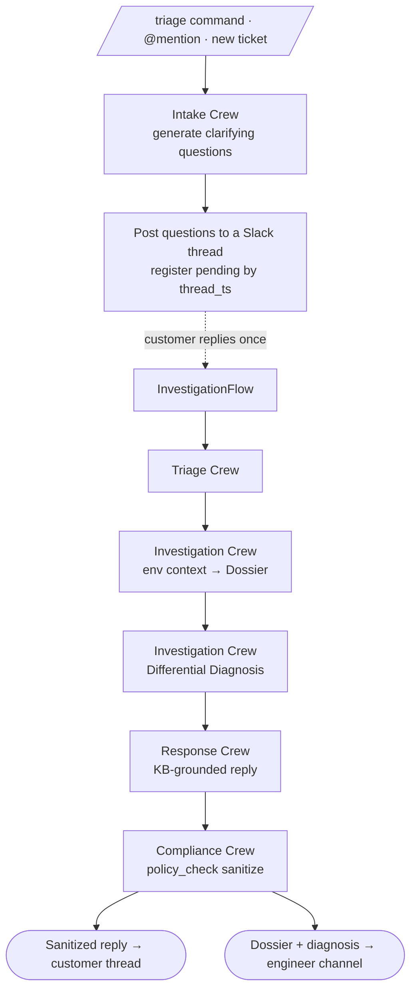

# Support Ticket Triage & Response

An automated support pipeline built as a [CrewAI](https://crewai.com) **Flow** that orchestrates three single-purpose crews. An incoming ticket is first **triaged** (category, urgency, and whether a human must handle it); tickets that need a person are escalated immediately without spending tokens on a draft. The rest go to a **response** crew that drafts a reply grounded in the knowledge base via a deterministic `kb_lookup` tool, then to a **compliance** crew that runs a deterministic, rule-based `policy_check` (refund promises, profanity, PII, missing disclaimer). If the checker finds a minor issue it can fix, the flow applies the correction and re-runs the check so the `passed` flag always reflects the text that would actually be sent — looping up to a capped number of attempts before escalating. Clean drafts are auto-sent; anything uncorrectable is routed to human review.

## Architecture



The flow and its shared state (`TicketState`) live in
[`flows/support_ticket_flow.py`](src/support_ticket_triage_and_response/flows/support_ticket_flow.py);
each crew is a declarative JSON config under
[`crews/`](src/support_ticket_triage_and_response/crews/).

## Agents

| Agent (role) | Crew | Responsibility | Tools | Structured output |
|---|---|---|---|---|
| **Support Ticket Classifier** | Triage Crew | Categorize the ticket, score urgency (1 = highest … 5 = lowest), and decide whether a human must review it | — | `TriageResult` |
| **{category} Support Specialist** | Response Crew | Draft a helpful, accurate reply grounded in the knowledge base and cite the KB article ids used | `kb_lookup` | `DraftResponse` |
| **Tone and Policy Reviewer** | Compliance Crew | Run the deterministic policy check, correct minor issues, or flag the ticket for a human | `policy_check` | `ComplianceCheck` |

Both tools are **deterministic and rule-based** (no LLM calls):
[`kb_lookup`](src/support_ticket_triage_and_response/tools/kb_lookup.py) does
keyword-overlap search over
[`kb_articles.json`](src/support_ticket_triage_and_response/kb_articles.json), and
[`policy_check`](src/support_ticket_triage_and_response/tools/policy_check.py)
enforces refund-approval, profanity, PII, and disclaimer rules.

## Setup

Requires **Python >=3.10, <3.14** and [uv](https://docs.astral.sh/uv/). Install the
CrewAI CLI if you don't have it:

```bash
uv tool install crewai
```

Install project dependencies:

```bash
crewai install
```

The agents use `anthropic/claude-sonnet-4-6`, so add your key to a `.env` file in
the project root:

```bash
ANTHROPIC_API_KEY=sk-ant-...
```

## Running

Run the flow over the bundled sample tickets:

```bash
crewai run
```

This triages each ticket in
[`sample_tickets.json`](src/support_ticket_triage_and_response/sample_tickets.json),
drafts and compliance-checks responses, and prints an expected-vs-actual summary
table (category, urgency, human-review, final status, and cited KB articles).

Generate an interactive HTML diagram of the flow:

```bash
crewai flow plot
```

To run a single ticket via the deployment trigger entry point:

```bash
uv run run_with_trigger '{"subject": "Duplicate charge", "text": "I was charged twice this month."}'
```

## Slack Investigation Flow

For hard tickets that need real investigation there is a second, Slack-invokable
pipeline, [`InvestigationFlow`](src/support_ticket_triage_and_response/flows/investigation_flow.py).
It can be triggered two ways — a `/triage` slash command (or an @mention) in
Slack, **or** a new-ticket event via `on_ticket_created` — and both converge on
the same single round-trip:



The customer's clarifying reply is awaited by the **Slack event loop**, not
inside the flow — the flow stays synchronous. The "production systems" are
mocked with the same deterministic keyword-overlap style as `kb_lookup`: the
**Production Investigator** agent gathers current state from five fixture-backed
tools —
[`log_search`](src/support_ticket_triage_and_response/tools/log_search.py),
[`metrics_lookup`](src/support_ticket_triage_and_response/tools/metrics_lookup.py),
[`incident_lookup`](src/support_ticket_triage_and_response/tools/incident_lookup.py),
[`past_tickets_lookup`](src/support_ticket_triage_and_response/tools/past_tickets_lookup.py),
and [`past_slack_lookup`](src/support_ticket_triage_and_response/tools/past_slack_lookup.py)
(fixtures live under [`fixtures/`](src/support_ticket_triage_and_response/fixtures/)).
The engineer channel receives the full dossier + differential diagnosis; the
customer thread receives only the reply after it passes the same `policy_check`
sanitization used by the main flow.

Slack is **real** (Bolt / Socket Mode). Add these to `.env` and create a Slack
app with a `/triage` slash command, the `app_mention` and `message.channels`
event subscriptions, and Socket Mode enabled:

```bash
SLACK_BOT_TOKEN=xoxb-...        # bot token (chat:write, commands, app_mentions:read)
SLACK_APP_TOKEN=xapp-...        # app-level token for Socket Mode (connections:write)
SLACK_CUSTOMER_CHANNEL=C0123... # channel new-ticket threads open in
SLACK_ENGINEER_CHANNEL=C0456... # channel the dossier + diagnosis is posted to
# SLACK_PENDING_STORE=/path/pending.json  # optional: persist in-flight threads across restarts
```

Run the listener, then use `/triage <describe the issue>` in the customer
channel and reply once in the thread:

```bash
uv run run_slack
```

Fire the same pipeline from a new-ticket event (posts the questions and returns):

```bash
uv run on_ticket_created '{"subject": "Dashboard won'\''t load", "text": "It just spins since this morning'\''s update."}'
```

## Testing

```bash
uv run pytest -q
```

The whole suite runs **offline** — no API key, no LLM calls, no cost — because
the flow tests mock the crew kickoffs with canned result objects.

| File | Covers |
|---|---|
| [`tests/test_tools.py`](tests/test_tools.py) | `kb_lookup` (search, category filter, limits, no-match) and `policy_check` (refund/profanity/PII/disclaimer rules, Luhn validation, masking) |
| [`tests/test_flow_routing.py`](tests/test_flow_routing.py) | `SupportTicketFlow` routing — triage gate, auto-send, the revise→recheck loop, the attempt cap, and escalation paths |
| [`tests/test_env_tools.py`](tests/test_env_tools.py) | The shared fixture search and the five investigation context tools (log/metrics/incident/prior-ticket/prior-Slack lookup) |
| [`tests/test_investigation_flow.py`](tests/test_investigation_flow.py) | `InvestigationFlow` wiring — dossier/diagnosis extraction, and sanitization of the customer reply |
| [`tests/test_slack_handlers.py`](tests/test_slack_handlers.py) | Slack pure logic — pending-thread store, question formatting, Phase-1 posting, and Phase-2 dossier/reply posting |

## Observability

CrewAI traces give a visual timeline of the whole run — every triage decision,
tool call (with arguments and results), routing choice, LLM call, and token
count. This is the fastest way to see *why* a ticket was auto-sent vs. escalated,
or why the compliance loop fired. **Traces are free and need no account.**

```bash
crewai traces enable    # turn on trace collection for future runs
crewai run              # prints a trace link when the run finishes
crewai traces disable   # turn it back off
```

For CI or any non-interactive run, enable it per-run instead:

```bash
CREWAI_TRACING_ENABLED=true crewai run
```

Without a CrewAI account you get an **ephemeral link valid for 24 hours**; run
`crewai login` (free) to persist traces across runs.

> ⚠️ Anyone with a trace link can read the trace, which can include ticket text,
> tool arguments/results, and LLM prompts and responses. Confirm a run carried no
> secrets or real customer PII before sharing a link.

## Deployment

A working flow can be deployed to CrewAI AMP as a scaling REST API — no
Dockerfile or server to maintain. Prerequisites: the flow runs locally, the code
is in a GitHub repo, `pyproject.toml` has `[tool.crewai] type = "flow"` (it does),
and `uv.lock` is committed (`uv lock`).

```bash
crewai login            # free account
crewai deploy create    # auto-detects the repo, transfers .env vars securely
crewai deploy status    # first deploy usually takes about a minute
crewai deploy logs      # view deployment logs
```

The deployed automation exposes:

| Endpoint | Purpose |
|---|---|
| `/inputs` | List required input parameters |
| `/kickoff` | Trigger a run (send a ticket payload) |
| `/status/{kickoff_id}` | Check run status and fetch the result |

Push code updates with `crewai deploy push`. Remember to set `ANTHROPIC_API_KEY`
in the deployment's environment variables.
